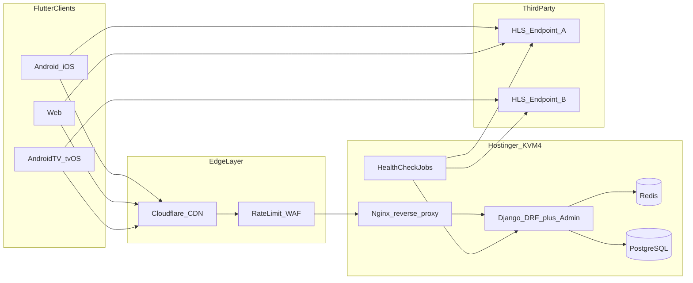
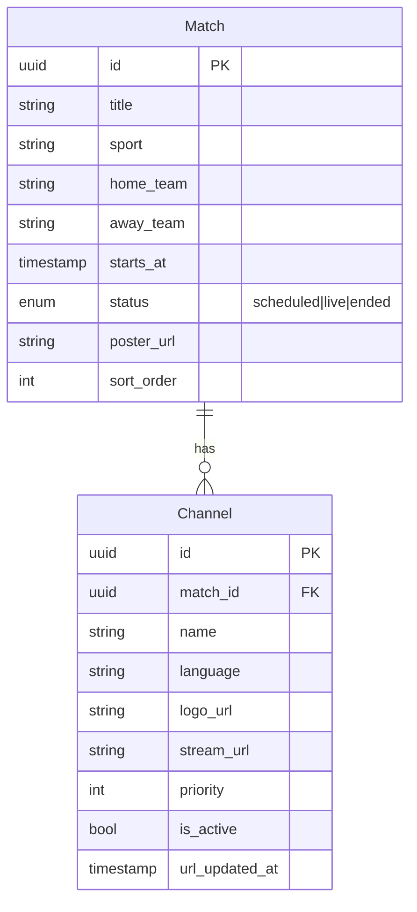
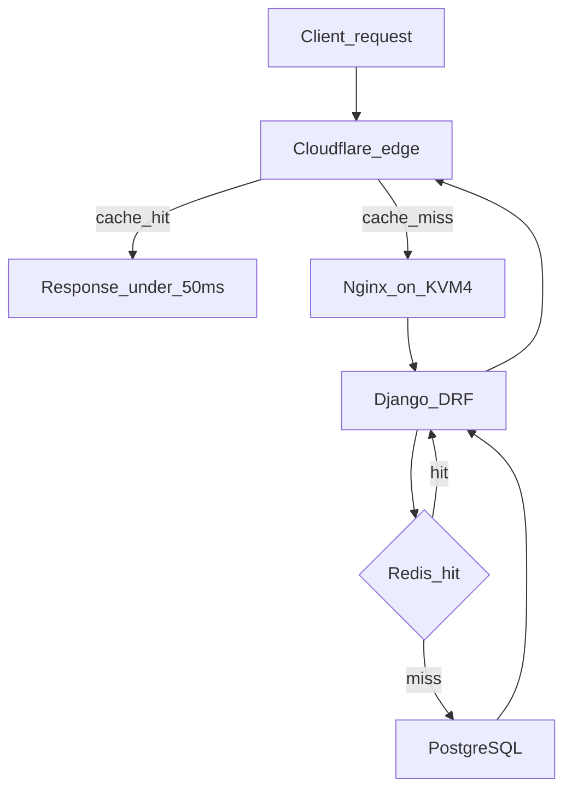

# Architecture — Live TV App

## Context

- **Greenfield workspace:** `/home/bs-01336/Desktop/live-tv`
- **Confirmed choices:** third-party HLS/m3u8 URLs, free/no login, mobile + web + smart TV, **Hostinger KVM4 VPS** + **Cloudflare CDN**, **Django + Django Admin** backend
- **Scale target:** ~100k users; peak 5–15% concurrent during live events → **5k–15k simultaneous viewers**

## System overview

Video traffic stays off your infrastructure. The backend serves **match + channel metadata** and optional **URL rotation/health checks** only.



## Technology stack

| Layer | Choice | Why |
|-------|--------|-----|
| Client | Flutter 3.x + `go_router` + Riverpod | One codebase for Android, iOS, Web, Android TV |
| Player | `media_kit` (or `video_player` + HLS) | Strong HLS support across platforms |
| Backend | Django 5 + Django REST Framework | API + admin in one codebase |
| DB | PostgreSQL (Django ORM) | Relational match/channel model |
| Cache | django-redis + Cloudflare edge cache | Protects origin during match spikes |
| Admin | Django Admin | Inline channels, staff auth, CSV import |
| Hosting | Hostinger KVM4 behind Cloudflare CDN | Cost-effective; CF absorbs peak reads |
| Observability | Sentry, Firebase Analytics, Uptime Kuma | Errors + anonymous usage + uptime |

## Data model



## API contracts (v1)

| Endpoint | Purpose |
|----------|---------|
| `GET /v1/matches?status=live&page=1&limit=20` | Paginated match list for homepage |
| `GET /v1/matches/{id}` | Match detail + ordered active channels |
| `GET /v1/matches/{id}/channels` | Channel list only (channel switching) |
| `GET /v1/health` | Uptime probe |

**Rule:** never bake stream URLs into the Flutter app. Fetch on player open so dead links can be rotated without an app store release.

## Project layout

```
live-tv/
  app/                          # Flutter client
    lib/
      core/
      features/matches/
      features/player/
      routing/
      platform/
  backend/                      # Django + DRF + Admin
    config/
    matches/
    api/
    health/
  docs/
  docker-compose.yml
```

## Request flow (cached read path)



- **Target origin load at peak:** ~100–500 req/min (95%+ cache hit ratio on public GETs)
- **p95 < 300ms** achieved via Cloudflare + Redis, not framework choice

## Infrastructure (Hostinger KVM4)

**Specs:** 4 vCPU, 16 GB RAM, 200 GB NVMe, 16 TB bandwidth, 1 Gbps port.

| Service | Role | RAM (approx) |
|---------|------|--------------|
| Nginx | Reverse proxy, TLS, static/media | 256 MB |
| Django (Gunicorn, 3–4 workers) | DRF API + `/admin/` | 1–2 GB |
| PostgreSQL 16 | Primary datastore | 2–4 GB |
| Redis 7 | django-redis cache | 512 MB–1 GB |
| Cron | `manage.py check_streams` | minimal |

### Cloudflare (required for scale on one VPS)

- Orange-cloud proxy on `api.yourdomain.com`
- Cache Rules: `GET /v1/matches*` and `GET /v1/matches/{id}/channels` for 30–60s
- WAF rate limit: 60 req/min per IP on `/v1/`
- Full (Strict) SSL between Cloudflare and Nginx
- `/admin/` excluded from cache; optional IP allowlist for staff

### Growth path

1. Upgrade to KVM8 when origin CPU >70% sustained
2. Optional second KVM4 as read-replica API node
3. Managed PostgreSQL only if backup/disk ops become painful

## Security model

| Surface | Access |
|---------|--------|
| `/v1/*` | Public read-only (AllowAny) |
| `/admin/` | Staff login only; not CDN-cached |
| HLS streams | Direct from third-party; never proxied through VPS |

## Platform notes

| Platform | Notes |
|----------|-------|
| Android / iOS | PiP and background audio in Phase 3 |
| Web | Validate HLS + CORS in week 1 |
| Android TV | Leanback, D-pad focus (Phase 2) |
| tvOS | Phase 3; evaluate Flutter tvOS vs native shell |

## Risks

1. Third-party stream URLs go dead — health checks + admin are mandatory
2. Web CORS on some HLS hosts
3. App store policy for third-party streams
4. Thundering herd on KVM4 without Cloudflare + Redis caching
5. Single-VPS SPOF — weekly backups + restore runbook

## Related docs

- [Feature list](./feature-list.md)
- [Best practices](./best-practices.md)
