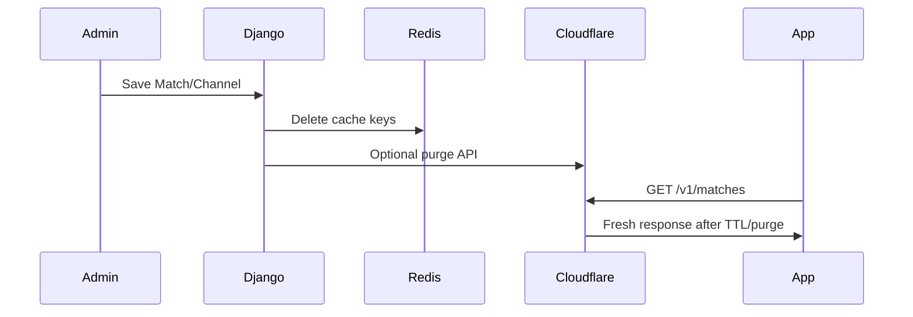

# Best Practices — Live TV App

Guidance for Django/DRF backend and Flutter client, aligned with official documentation via [Context7](https://context7.com) and tailored to this project (metadata API, third-party HLS, KVM4 + Cloudflare, ~100k users).

---

## Django backend

Sources: [Django 5.2 deployment checklist](https://docs.djangoproject.com/en/5.2/howto/deployment/checklist), [Django caching](https://docs.djangoproject.com/en/5.2/topics/cache)

### Production security (mandatory)

| Setting | Rule |
|---------|------|
| `DEBUG` | **Never `True` in production** — leaks source, settings, and local variables |
| `ALLOWED_HOSTS` | Must be set and non-empty; reject unknown Host headers |
| `SECRET_KEY` | Unique per environment; never committed to git |
| `CSRF` | Enabled for `/admin/`; not needed for read-only `/v1/` GET |
| HTTPS | Terminate at Cloudflare; Full (Strict) to Nginx origin |

Run `python manage.py check --deploy` before every production deploy.

### Caching with Redis

Use Django's built-in Redis cache backend (Django 5.2+):

```python
CACHES = {
    "default": {
        "BACKEND": "django.core.cache.backends.redis.RedisCache",
        "LOCATION": "redis://127.0.0.1:6379/1",
    }
}
```

**Project-specific rules:**

1. Cache `GET /v1/matches` and channel lists with 30–60s TTL
2. Invalidate cache in `post_save` / `post_delete` signals on `Match` and `Channel`
3. Pair with Cloudflare edge cache — Redis protects origin on CF misses
4. Never cache `/admin/` or authenticated routes

### Database

- Add indexes: `(status, starts_at)` on Match; `(match_id, priority)` on Channel
- Use `select_related` / `prefetch_related` when serializing channels with matches
- Keep migrations in version control; run migrations in deploy script before Gunicorn restart
- Regular `pg_dump` backups (Hostinger weekly + manual before deploys)

### Gunicorn on KVM4

- **3–4 workers** on KVM4 (rule of thumb: `2 × CPU + 1` max, but leave RAM for PostgreSQL)
- Set request timeout ≥ 30s for admin; API reads should complete in <100ms
- Use `--max-requests 1000` with jitter to mitigate memory leaks

### Django Admin

- Register `Channel` as `TabularInline` on `MatchAdmin`
- Restrict admin URL; consider Cloudflare IP allowlist for `/admin/`
- Use `django-import-export` for CSV bulk loads on busy match days
- Staff users only — never expose admin to public

### Health checks

- `manage.py check_streams` as cron during live events
- Probe with timeout (5s); mark `is_active=False` after 3 failures
- Log failures; optional email to staff via `django.core.mail`

---

## Django REST Framework

Sources: [DRF generic views](https://www.django-rest-framework.org/api-guide/generic-views), [DRF pagination](https://www.django-rest-framework.org/api-guide/pagination), [DRF relations](https://www.django-rest-framework.org/api-guide/relations)

### ViewSets and serializers

- Use `ReadOnlyModelViewSet` for public match/channel endpoints (no POST/PUT/DELETE)
- Set `permission_classes = [AllowAny]` only on read endpoints
- Override `get_queryset()` — never expose inactive channels (`is_active=True` filter)
- Keep serializers slim: only fields the Flutter app needs (smaller JSON = faster at scale)

### Query optimization

DRF does **not** auto-optimize queries. Always optimize in `get_queryset()`:

```python
def get_queryset(self):
    return Match.objects.filter(status="live").prefetch_related(
        "channels"
    ).order_by("-starts_at")
```

Failure to prefetch causes N+1 queries — critical when Cloudflare cache misses spike during live events.

### Pagination

- Use `PageNumberPagination` with `page_size = 20` on match list
- Disable pagination on channel list per match (small dataset)
- Return consistent envelope: `{ "count", "next", "previous", "results" }`

### Filtering

- Use `django-filter` with `filterset_fields = ["status", "sport"]`
- Validate query params; return 400 on invalid `status` values

### Throttling (optional belt-and-suspenders)

- Cloudflare WAF is primary rate limiter
- Optional DRF `AnonRateThrottle` as backup: e.g. 60/minute

### Caching pattern

```python
from django.views.decorators.cache import cache_page
from django.utils.decorators import method_decorator

@method_decorator(cache_page(60), name="list")
class MatchViewSet(viewsets.ReadOnlyModelViewSet):
    ...
```

Prefer explicit cache keys per `status` + `page` if using manual Redis invalidation.

### API versioning

- Prefix all routes with `/v1/` — allows breaking changes in `/v2/` later without breaking old app versions

---

## Flutter client

Sources: [Flutter app architecture](https://docs.flutter.dev/app-architecture), [MVVM pattern](https://docs.flutter.dev/learn/pathway/tutorial/change-notifier), [Command pattern](https://docs.flutter.dev/app-architecture/design-patterns/command)

### Architecture (MVVM + feature folders)

Follow Flutter's recommended layered structure:

```
UI (View) → ViewModel (Riverpod providers) → Repository → API client
```

| Layer | Responsibility |
|-------|----------------|
| **View** | Widgets only; no direct HTTP calls |
| **ViewModel** | State, loading/error via Riverpod `AsyncNotifier` |
| **Repository** | Cache policy, maps DTOs → domain models |
| **Service** | Dio HTTP client, base URL, interceptors |

### State management (Riverpod)

- `matchesProvider` — `AsyncNotifier` for match list with stale-while-revalidate
- `matchDetailProvider(matchId)` — family provider for channels
- `activeChannelProvider(matchId)` — currently selected channel in player
- Use `ref.invalidate()` on pull-to-refresh; avoid rebuilding entire tree

### Command / async UI pattern

Mirror Flutter's Command pattern for load/play actions:

1. Emit **loading** state → show `CircularProgressIndicator`
2. On success → render data
3. On error → show retry UI with message

Use `AsyncValue.when(loading:, error:, data:)` from Riverpod instead of manual flags where possible.

### List performance

- `ListView.builder` for match list — lazy build only visible items
- Cache network images (`cached_network_image`) for posters/logos
- Paginate (20 items); load next page at scroll end
- Do not fetch all 100+ matches at once

### Player

- Initialize player only when `PlayerPage` opens — not on list screen
- On channel switch: **dispose** old controller → create new → load URL
- Handle HLS errors gracefully; offer retry + next channel
- Test real m3u8 URLs on Android, iOS, and Web in week 1 (CORS on web)

### Networking

- Single Dio instance with base URL, timeouts (connect 10s, receive 30s)
- Parse JSON into typed models (freezed or manual `fromJson`)
- Never hardcode stream URLs — always fetch from API
- Client-side cache (~60s) to reduce API calls when switching channels

### Routing (go_router)

- `/` → MatchListPage
- `/match/:id` → PlayerPage
- Deep links for match sharing (Phase 3)
- Preserve back-stack so list scroll position is restored

### Platform-specific

| Platform | Practice |
|----------|----------|
| Android TV | `FocusTraversalGroup`, larger touch targets, no hover-only UI |
| Web | Test HLS in Chrome + Safari; plan CORS fallback early |
| iOS | Respect safe areas; test background audio policy |
| All | Use `ThemeData` + responsive breakpoints; avoid platform checks in business logic |

### Testing

| Type | What to test |
|------|--------------|
| Unit | Repository parsing, channel sort by priority, cache logic |
| Widget | MatchCard, ChannelSwitcher, loading/error states |
| Integration | API contract against staging backend |

### Error reporting

- Sentry for crash and API error breadcrumbs
- Firebase Analytics for anonymous screen views (no PII)

---

## Cross-cutting (backend + client)

### Performance priority order

1. **Cloudflare edge cache** on `GET /v1/matches*` (biggest win)
2. **Redis** on Django for cache misses
3. **PostgreSQL indexes** + `prefetch_related`
4. **Slim JSON** + pagination
5. **Flutter client cache** + lazy list/player init
6. Framework choice (negligible at this scale)

### Cache invalidation flow



### What not to do

- Proxy HLS video through KVM4
- Bake stream URLs in the Flutter binary
- Run `DEBUG=True` in production
- Skip `prefetch_related` on match + channels queryset
- Build all list items upfront (`ListView` without builder)
- Cache `/admin/` at Cloudflare

---

## Related docs

- [Architecture](./architecture.md)
- [Feature list](./feature-list.md)
